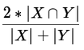

# EENG645A - Final Project - Nathan Gaul

## Dataset

Download the [Severstal: Steel Defect Detection dataset](https://www.kaggle.com/c/severstal-steel-defect-detection/data) from Kaggle and unzip into `/opt/data` with the following folder structure:
```
/opt/data/
  > gaul_severstal_data/
    > train_images/
    > test_images/
    > train.csv
    > sample_submission.csv
```

### Data Count
- train images: 12568
- test images: 5506 (labels are not available publicly for these)

All images are 1600 pixels wide and 256 pixels high.

### Data Labels

`train.csv` has 7095 damage sites, with each site having the ImageId (image file name), the ClassId of that data (1, 2, 3, or 4), and its EncodedPixels.
- ImageId: matches an image file in the `train_images` directory
    - a single image may have multiple damage sites
- ClassId: a number from 1 to 4 representing the class of damage that the damage site falls into
    - the listing on Kaggle does not make it clear what the different classes mean
- EncodedPixels: an arbitrary length, space delimited, run-length encoding of pixel values where the damage site is located in
    - e.g. '1 3' implies the pixels '1, 2, 3' and '1 3 10 5' implies '1, 2, 3, 10, 11, 12, 13, 14'
  
# Evaluation

The Kaggle competition is evaluated on the mean [Dice coefficient](https://en.wikipedia.org/wiki/S%C3%B8rensen%E2%80%93Dice_coefficient), which can...
> ...be used to compare the pixel-wise agreement between a predicted segmentation and its corresponding ground truth. The formula is given by:
> 
> 
> 
> where X is the predicted set of pixels and Y is the ground truth. The Dice coefficient is defined to be 1 when both X and Y are empty. The leaderboard score is the mean of the Dice coefficients for each <ImageId, ClassId> pair in the test set.

# Baseline


# 